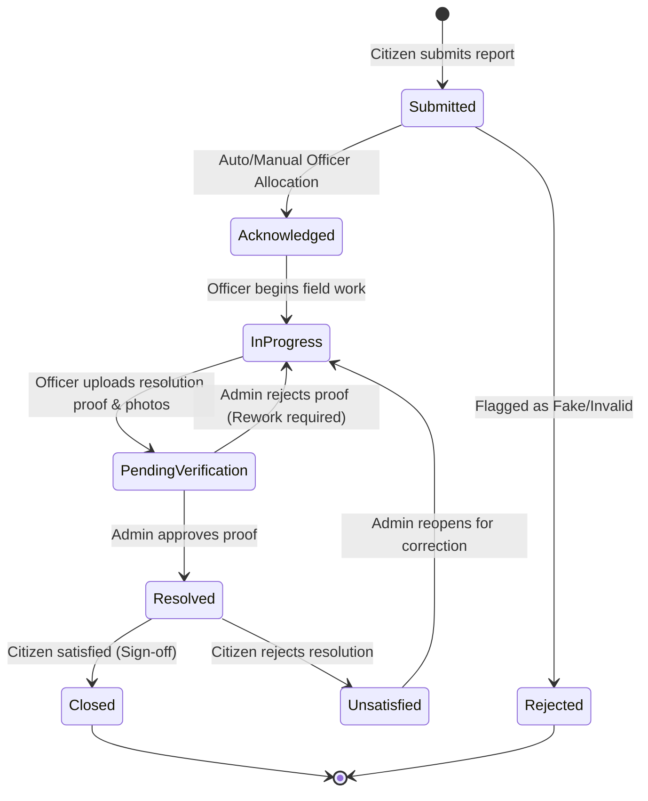

# 🏛️ LokSamadhan (লোকসমাধান)
### Transparent Civic Issue Resolution & Grievance Tracker

[](https://www.loksamadhan.online)

[](https://nodejs.org/)
[](https://react.dev/)
[](https://tailwindcss.com/)
[](https://www.mongodb.com/)
[](LICENSE)

> 🌐 **Live Website:** [https://www.loksamadhan.online](https://www.loksamadhan.online)

**LokSamadhan** is a public civic grievance redressal and tracking platform designed for municipalities across Assam, India (built for hackathon challenge **WEB03**). It bridges citizens, municipal field officers, and administrative authorities through an open, accountable, and tamper-resistant workflow.

Every civic complaint—from potholes and overflowing garbage to broken streetlights and water pipe bursts—is tracked publicly with human-readable tracking IDs (`#LS-YYYY-XXXXXX`), geo-tagged on interactive maps, automatically deduplicated, prioritized via dynamic SLAs, and verified with before/after AI vision inspection.

---

## 📑 Table of Contents

- [Key Highlights](#-key-highlights)
- [System Architecture](#-system-architecture)
- [Core Features by Role](#-core-features-by-role)
  - [For Citizens](#1-citizens)
  - [For Field Officers](#2-field-officers)
  - [For Municipal Admins](#3-municipal-admins)
- [Issue Lifecycle & Workflow](#-issue-lifecycle--workflow)
- [The Four Inviolable Hard Rules](#-the-four-inviolable-hard-rules)
- [Tech Stack](#-tech-stack)
- [Repository Structure](#-repository-structure)
- [Getting Started](#-getting-started)
  - [Prerequisites](#prerequisites)
  - [Backend Setup](#backend-setup)
  - [Frontend Setup](#frontend-setup)
- [Environment Variables](#-environment-variables)
- [Demo Credentials](#-demo-credentials)
- [API Overview](#-api-overview)

---

## ✨ Key Highlights

- **Public & Transparent by Default**: Real-time status changes and resolution trails are publicly accessible. No citizen complaint disappears into a black box.
- **Append-Only Audit Trail**: Every triage note, status update, rework directive, and proof submission is recorded chronologically and permanently.
- **Intelligent Deduplication & Community Voting**: Multiple reports within close geographic proximity (1 km / 200 m) are clustered together. Citizens can "upvote" existing issues, elevating priority instead of spamming duplicate tickets.
- **Dynamic SLA Management**: Automated response clocks categorized by issue severity (e.g., Water: 3 days, Roads: 7 days) with visual breach indicators.
- **AI-Powered Resolution Verification**: Automated computer vision comparisons (Groq Cloud / Qwen Vision) analyzing before-and-after photographic evidence prior to final administrative sign-off.
- **Bilingual Accessibility**: Instant on-the-fly bilingual interface (English ⇄ Assamese / অসমীয়া) with local storage caching.
- **Strict Privacy & Anti-Tamper Design**: Citizen identities and emails are shielded from public responses; reporter info is never leaked to unauthorized consumers.

---

## 🏗️ System Architecture

```
                               ┌────────────────────────────────┐
                               │   Vite + React 19 Frontend     │
                               │  (Tailwind v4, Leaflet Maps)   │
                               └──────────────┬─────────────────┘
                                              │ REST API / JWT
                                              ▼
                               ┌────────────────────────────────┐
                               │     Express 4 + Node.js API    │
                               │  (Role Auth, SLA, GeoEngine)   │
                               └───────┬──────────────┬─────────┘
                                       │              │
             ┌─────────────────────────┼──────────────┼────────────────────────┐
             ▼                         ▼              ▼                        ▼
    ┌─────────────────┐       ┌────────────────┐ ┌──────────────┐     ┌────────────────┐
    │  MongoDB Atlas  │       │ Cloudinary CDN │ │  Groq Cloud  │     │   OSM / Mail   │
    │  (GeoJSON 2dsphere,     │ (Photo Proofs, │ │ (AI Vision   │     │  (Nominatim,   │
    │   Append Audits)│       │  WebP 1200px)  │ │  Inspection) │     │   Nodemailer)  │
    └─────────────────┘       └────────────────┘ └──────────────┘     └────────────────┘
```

---

## 👥 Core Features by Role

### 1. Citizens
- **Frictionless Reporting**: 4-step reporting workflow with category selection, drag-and-drop Leaflet map pin placement, address auto-detection (reverse-geocoded via Nominatim), and up to 3 photo uploads.
- **Draft Persistence**: Unauthenticated users can fill out complaints without losing drafts; drafts survive the login/registration step.
- **Issue Reference Codes**: Instantly query any issue using human-friendly codes (e.g., `#LS-2026-61AB11`) or share via one-click WhatsApp links.
- **Community Support (+1)**: Boost existing community complaints to escalate urgency and alert municipal departments.
- **Citizen Sign-off**: Once an officer marks an issue resolved, the original reporter must confirm satisfaction. Unsatisfied reports prompt rework instructions back to the administration.

### 2. Field Officers
- **Command Dashboard**: Dedicated workspace segmented by assignment queues (Allotted to Me, Department Queue, In Progress, SLA Overdue).
- **Progress Tracking & Rework**: Update status to "In Progress" or flag suspicious reports as "Rejected (Fake/Invalid)" with mandatory reason presets.
- **Resolution Proof Submissions**: Submit completion notes (min. 5 characters) along with photo evidence; automatically halts the SLA clock and forwards to Admin Verification.
- **Real-Time Notification Feed**: Polled updates informing officers of new allotments, citizen feedback, and rework directives.

### 3. Municipal Admins
- **Triage Center**: Unified view of all unassigned or escalated civic issues across departments (Roads, Water, Sanitation, Streetlight, Drainage, General).
- **Smart Load-Balanced Assignment**: Assign issues dynamically based on officer workload per district/region or manually re-route across jurisdictions.
- **AI Verification Inspector**: Review automated match scores and confidence summaries generated by AI vision before approving officer repairs.
- **User & Department Management**: Full administrative control to register, update, and manage officer accounts, regions, and view productivity metrics.
- **Analytics & Reporting**: Real-time performance breakdown, SLA adherence metrics, and filtered one-click CSV report exports.

---

## 🔄 Issue Lifecycle & Workflow



---

## 🛡️ The Four Inviolable Hard Rules

Enforced strictly **server-side** to guarantee system transparency and civic integrity:

1. **Duplicates are Linked, Never Deleted**: Duplicate reports are clustered under the primary root issue via a pointer. Both remain queryable, and community votes merge.
2. **Resolution Demands Concrete Proof**: Marking an issue resolved requires a mandatory descriptive note ($\ge 5$ chars) and photographic proof.
3. **Citizen Privacy is Protected**: Personal reporter information (email, phone, etc.) is never exposed in public queries or API serializations.
4. **Standalone Civic Operations**: Complete independent system architecture with no hard dependency on external proprietary civic platforms.

---

## 💻 Tech Stack

### Frontend
- **Framework**: [React 19](https://react.dev/) + [Vite 8](https://vitejs.dev/)
- **Styling**: [Tailwind CSS v4](https://tailwindcss.com/) with custom civic design tokens
- **Routing**: [React Router 7](https://reactrouter.com/)
- **Maps**: [Leaflet 1.9](https://leafletjs.com/) + [React Leaflet 5](https://react-leaflet.js.org/) + OpenStreetMap
- **Authentication**: JWT local storage + [@react-oauth/google](https://www.npmjs.com/package/@react-oauth/google)
- **Internationalization**: Custom dynamic English ⇄ Assamese batch translation engine

### Backend
- **Runtime**: [Node.js](https://nodejs.org/) (CommonJS)
- **Framework**: [Express 4](https://expressjs.com/)
- **Database**: [MongoDB](https://www.mongodb.com/) via [Mongoose 9](https://mongoosejs.com/) (with `2dsphere` geospatial indices)
- **File Storage**: [Multer](https://github.com/expressjs/multer) (in-memory) + [Cloudinary](https://cloudinary.com/) (WebP conversion & auto-scaling)
- **AI Vision**: [Groq Cloud SDK / REST](https://groq.com/) (Qwen Vision models)
- **Email Service**: [Nodemailer](https://nodemailer.com/) (Gmail SMTP / generic SMTP fallback)
- **Geocoding**: OpenStreetMap Nominatim API

---

## 📁 Repository Structure

```text
loksamadhan/
├── client/                     # React Frontend Single Page App
│   ├── public/                 # Static assets, logos, favicons, robots.txt
│   ├── src/
│   │   ├── components/         # ~35 UI components (MapPicker, FeedMap, StatusTimeline, etc.)
│   │   ├── pages/              # Feed, Home, IssueDetail, Report, OfficerDashboard, etc.
│   │   ├── AuthContext.jsx     # User authentication state & methods
│   │   ├── LangContext.jsx     # Translation provider (EN / AS)
│   │   ├── api.js              # Centralized fetch wrapper with JWT injection
│   │   ├── assam.js            # Assam state geospatial bounds & coordinates
│   │   └── router.jsx          # Route declarations
│   └── vite.config.js          # Vite & Tailwind build configuration
│
├── server/                     # Express.js REST API Server
│   ├── api/                    # Serverless entry (Vercel deployment)
│   ├── lib/
│   │   ├── aiVision.js         # Groq AI Vision before/after inspection engine
│   │   ├── mailer.js           # Civic notification email templates & transporter
│   │   ├── serialize.js        # Privacy-enforcing data serializers
│   │   ├── similar.js          # Jaccard + Geo duplicate detection algorithm
│   │   ├── sla.js              # Dynamic SLA calculation & breach tracker
│   │   └── upload.js           # Cloudinary buffer upload handler
│   ├── middleware/auth.js      # JWT verification & role authorization (citizen/officer/admin)
│   ├── models/                 # Mongoose schemas (User, Issue, Otp)
│   ├── routes/                 # Endpoint controllers (auth, issues, admin, stats, ai, etc.)
│   ├── constants.js            # Frozen department enums, statuses, categories, and SLA tiers
│   ├── seed.js                 # Database seeder with complete lifecycle demonstration
│   └── server.js               # Local backend entry point
│
└── CONTRACT.md                 # Frozen API specifications and role definitions
```

---

## 🚀 Getting Started

### Prerequisites
- Node.js (v18.x or higher)
- MongoDB instance (local or MongoDB Atlas URI)
- Cloudinary Account (for image uploads)
- Groq Cloud API Key *(optional, fallback enabled for vision verification)*

---

### Backend Setup

1. **Navigate to the server directory**:
   ```bash
   cd server
   ```

2. **Install dependencies**:
   ```bash
   npm install
   ```

3. **Configure Environment Variables**:
   Create a `.env` file in `server/`:
   ```env
   PORT=5001
   MONGO_URI=mongodb://localhost:27017/loksamadhan
   JWT_SECRET=your_super_secret_jwt_key
   CLIENT_URL=http://localhost:5173

   # Image Hosting (Cloudinary)
   CLOUDINARY_CLOUD_NAME=your_cloud_name
   CLOUDINARY_API_KEY=your_cloudinary_key
   CLOUDINARY_API_SECRET=your_cloudinary_secret
   CLOUDINARY_FOLDER=loksamadhan

   # AI Verification (Optional)
   GROQ_API_KEY=your_groq_api_key

   # Email Service (Optional, prints to console if omitted)
   EMAIL_USER=your_email@gmail.com
   EMAIL_PASS=your_app_password
   ```

4. **Seed the database** (creates sample users, officers, and issues across all stages):
   ```bash
   npm run seed
   ```

5. **Start backend in development mode**:
   ```bash
   npm run dev
   ```
   *The server runs on `http://localhost:5001`.*

---

### Frontend Setup

1. **Navigate to the client directory**:
   ```bash
   cd ../client
   ```

2. **Install dependencies**:
   ```bash
   npm install
   ```

3. **Configure Environment Variables**:
   Create a `.env` file in `client/`:
   ```env
   VITE_API_URL=http://localhost:5001
   VITE_SITE_URL=http://localhost:5173
   # Optional: Google OAuth Client ID
   # VITE_GOOGLE_CLIENT_ID=your_google_client_id
   ```

4. **Start Vite development server**:
   ```bash
   npm run dev
   ```
   *The client runs on `http://localhost:5173`.*

---

## 🔑 Demo Credentials
 
> 🌐 **Live Website:** [https://www.loksamadhan.online](https://www.loksamadhan.online)
 
Run `npm run seed` in the `server` directory to populate the following demo accounts (all accounts share the default password: `password123`):

| Role | Name | Email | Department / Region |
|---|---|---|---|
| **Admin** | Admin Bora | `admin@loksamadhan.gov.in` | General Administration |
| **Officer** | Rina Das | `rina.roads@tezpur.gov.in` | Roads & Infrastructure (Tezpur) |
| **Officer** | Bhaskar Nath | `bhaskar.water@tezpur.gov.in` | Water Supply & Sewage (Tezpur) |
| **Officer** | Mira Hazarika | `mira.sanitation@tezpur.gov.in` | Solid Waste Management (Tezpur) |
| **Officer** | Pranjal Bora | `pranjal.roads@jorhat.gov.in` | Roads & Infrastructure (Jorhat) |
| **Citizen** | Ankur Sharma | `citizen1@example.com` | Registered Citizen |
| **Citizen** | Priyanku Kalita | `citizen2@example.com` | Registered Citizen |

---

## 📡 API Overview

| Method | Endpoint | Access | Description |
|---|---|---|---|
| `POST` | `/api/auth/register` | Public | Register a new citizen account with email OTP |
| `POST` | `/api/auth/login` | Public | Authenticate user & return 7-day JWT |
| `GET` | `/api/issues` | Public | Query filtered, paginated civic reports (with geo/radius bounds) |
| `GET` | `/api/issues/:id` | Public | Retrieve full detail, timeline, and duplicate links of an issue |
| `GET` | `/api/issues/lookup/:ref` | Public | Resolve an `#LS-YYYY-XXXXXX` reference ID to canonical issue |
| `POST` | `/api/issues` | Citizen / Auth | Submit a new civic grievance with photos and coordinates |
| `POST` | `/api/issues/:id/support` | Citizen / Auth | Add citizen community vote to prioritize an issue |
| `PATCH` | `/api/issues/:id/status` | Officer / Admin | Update workflow status with reason / evidence |
| `POST` | `/api/issues/:id/report-resolution` | Officer | Submit repair completion proof & photos |
| `POST` | `/api/issues/:id/verify-resolution` | Admin | Approve or reject resolution proof |
| `POST` | `/api/issues/:id/citizen-feedback` | Reporter | Citizen sign-off (`satisfied: true/false`) |
| `POST` | `/api/ai/issues/:id/verify-resolution` | Staff | Run Groq AI vision inspection on repair proof |
| `GET` | `/api/stats` | Public | Aggregated SLA performance, status counters & sparkline data |
| `GET` | `/api/admin/users` | Admin | Fetch all municipal staff and compute workload ratios |

---

## 📄 License & Attribution

Developed for **Hackathon Problem WEB03**. Released under the [MIT License](LICENSE).  
*Built with care for public transparency and civic empowerment across Assam.*
